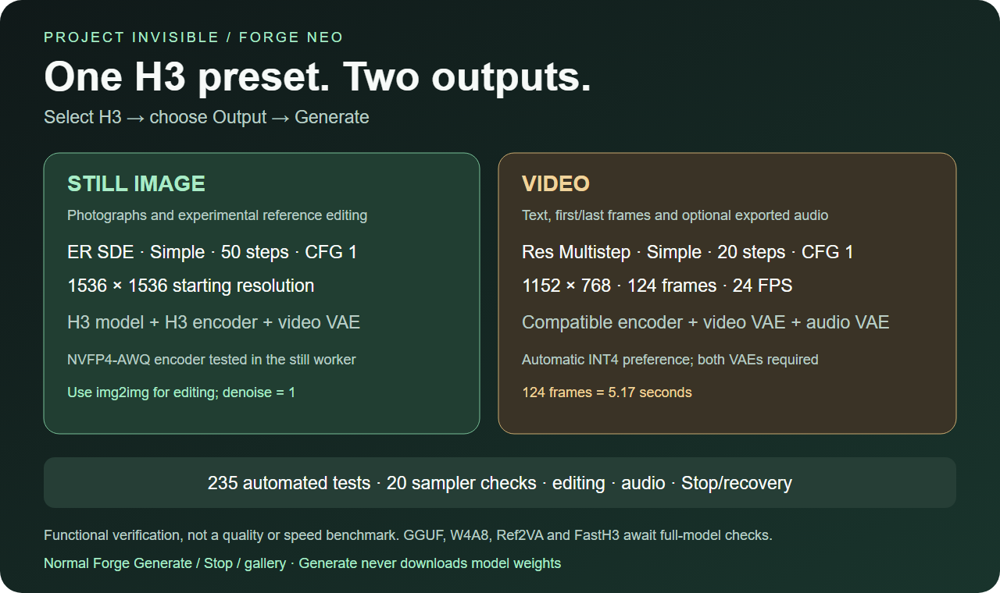
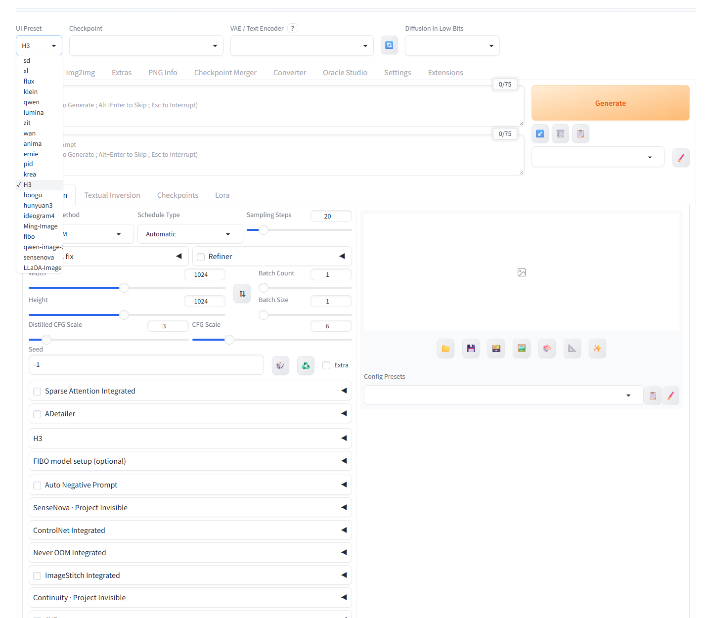
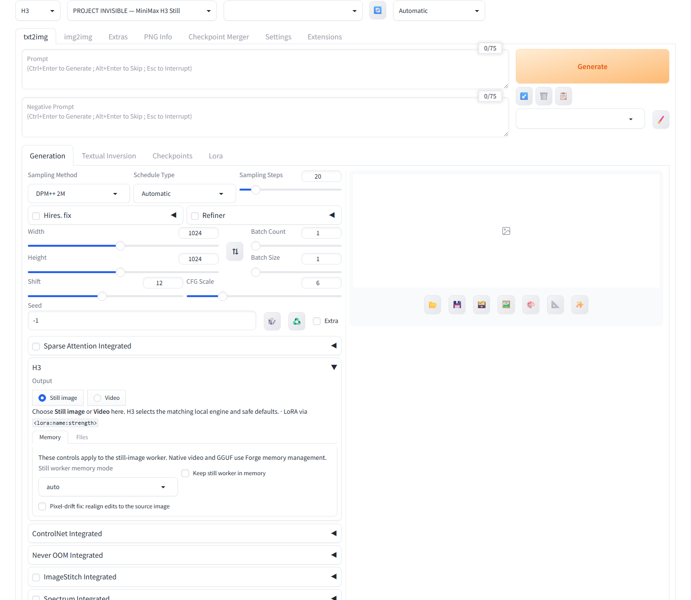
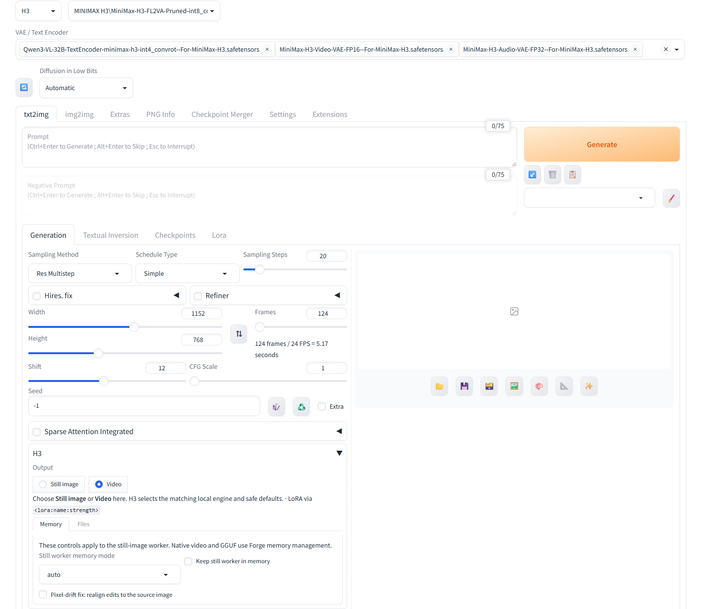
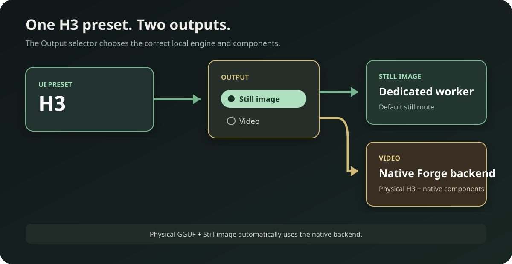
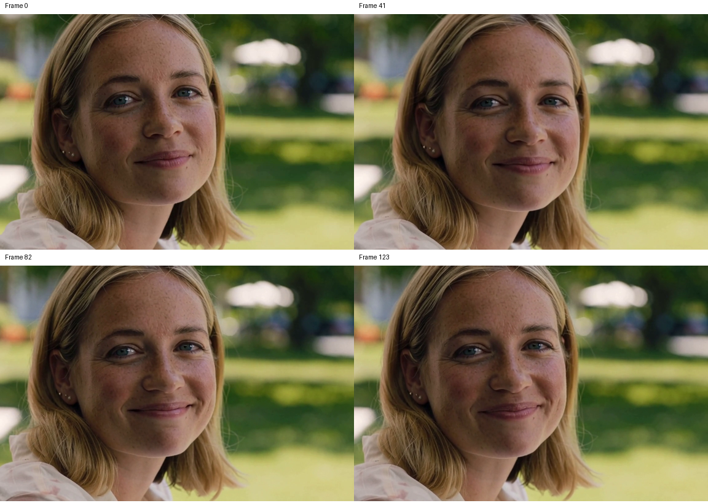

# Project Invisible — H3

MiniMax H3 still images, reference editing, and native video with sound inside **Forge Neo**.
Select **H3** under **UI Preset**, then use the normal **Generate** button.

[Project page](https://mishrasiddharth08.github.io/Project-Invisible-H3-extension/) · [Test results](VALIDATION.md) · [Quantization support](QUANTIZATION.md)

## H3 quick guide



## New Forge Neo UI

Select **H3** once in **UI Preset**. Open the **H3** panel and choose **Still image** or **Video**. The switch selects the matching components and defaults, then you use the usual **Generate** and **Stop** buttons.

### One H3 preset



### Still image



Use txt2img to create an image, or img2img to edit a reference. Memory and file controls are inside the H3 panel.

### Video



Video starts at **1152 × 768**, **124 frames / 24 FPS**, **20 steps**, **Res Multistep / Simple**, and **CFG 1**. Its audio controls are in the **MiniMax H3** accordion. Both the video and audio VAEs are required, including for silent export.

<details>
<summary>How the two output routes work</summary>



</details>

## Unified H3 preset

AiKimi-inspired diagnostics: `GET /pi-h3/status` reports the selected H3 backend, native activation and worker state. It does not start a worker or expose local file paths. Source: [AiKimi Forge Neo](https://github.com/AiWithYou/aikimi-forge-neo).

The pinned Eduardo Abreu v0.6.0 backend is bundled in this extension. Select the single **H3** preset, then choose **Still image** or **Video** in its Output control. Still image is routed to the isolated Fizgig worker by default. Video selects the physical H3 checkpoint and compatible native components. A physical GGUF checkpoint uses the native backend for either output. Use Generate as usual.

Native features include text-to-video with sound, FL2VA first/last frames, Ref2VA references (up to nine using ImageStitch Integrated), GGUF diffusion checkpoints, W4A8/INT4 components, FastH3, sparse attention, TAESD previews, audio shift and file-backed offloading. Optional ImageStitch/Sparse Attention integrations require their Forge components. Actual formats depend on compatible model files and Forge kernels.

Requires Forge Neo revision `d70373e` or newer and comfy-kitchen 0.2.37. Compatibility checks disable the native path when requirements are absent. Use one H3 extension installation; remove a separate `minimax-h3-forge-neo` installation to avoid duplicate runtime hooks.

**Encoder difference:** the native backend rejects NVFP4-AWQ encoders because upstream observed incorrect conditioning. Our H3 still worker continues to support the locally tested NVFP4-AWQ encoder. For native video, use the compatible INT4, INT8 ConvRot or BF16 encoder. Both VAEs are required, even for silent export. No weights are downloaded by Generate.

The combined distribution is AGPL-3.0; each bundled component retains its copyright and license. Credits: [Eduardo Abreu / minimax-h3-forge-neo](https://github.com/eduardoabreu81/minimax-h3-forge-neo), revision `8ec38de8a10bcb924033278dfff64e25fdfc88be`. See NOTICE and licenses/.

### Current verification

Small local API checks used the physical FL2VA int8 ConvRot checkpoint and the approved Qwen3-VL-32B INT4 ConvRot encoder at 384 × 256, seed 62026:

* Native **Still image**: HTTP 200, one image, 2 steps, 34.74 seconds.
* **Video with audio**: HTTP 200, 22 frames, MP4 written, 4 steps, 21.49 seconds.
* **Silent video**: HTTP 200, 22 frames, MP4 written, 4 steps, 15.02 seconds.

These are functional checks, not quality or speed benchmarks.

The unified **H3** API then passed Video with audio (46.17 seconds), silent Video (16.38 seconds), first-frame conditioning (31.53 seconds), last-frame conditioning (22.97 seconds), and combined first/last-frame conditioning (22.89 seconds). The live UI contract contained exactly one H3 preset and both Output choices.

The dedicated worker passed all 20 tested sampler/scheduler combinations after restart. Its first cold ER SDE / Simple request took 60.2 seconds; warm checks took 2.08–3.88 seconds at the tiny test settings. An earlier startup interruption was not reproduced, so its exact cause remains unknown.

Unified Still image editing also returned HTTP 200 in 66.34 seconds at 512 × 768. Visual inspection found natural pores and the requested blue-sea background; this is one inspected image, not a general fidelity claim.

**Stop fixed and verified:** an H3-only cancellation guard removed the prior `NoneType` error. Early Stop returned HTTP 200 with zero images in 11.36 seconds; Stop during sampling returned HTTP 200 with zero images in 8.99 seconds. Both follow-up recovery requests returned one image.


## Video quality correction

The reported poor clips used **384 × 256, 4 steps and 22 frames**; one also used the incompatible NVFP4 native encoder. Those files are functional smoke tests, not quality examples. Native video rejects that encoder; use INT4 ConvRot, compatible INT8, or BF16.

Video now starts at **1152 × 768**, matching upstream's recommended 768-pixel short side, with 20 steps, 124 frames, CFG 1, video Shift 12 and audio Shift 3. Higher resolution needs more processing time. An empty component override now correctly chooses the automatic H3 components.

A new RTX 5090 run at these settings, seed 62026, completed in **335.82 seconds including loading**. Four sampled frames showed consistent facial features, visible freckles and finer detail than the tiny smoke clips. This is one inspected result, not a universal quality guarantee.



[Watch the generated 5.17-second H3 sample](docs/assets/video-quality-768p.mp4). This example was generated with H3; no upscaling or sharpening was applied.

## Project Invisible

Use the familiar Forge workflow: native preset/checkpoint selectors, txt2img,
img2img, Generate, Stop, gallery and saving. Special controls appear only for H3.
No additional tab, virtual environment, ComfyUI server or Forge core changes.
The H3 still backend runs in a dedicated process using Forge's Python. Its
files and helper packages live inside this extension; closing that process
releases its RAM and VRAM. Other engines retain their ordinary paths.

## Installation

Download this repository as ZIP and extract it into Forge’s `extensions` folder,
or use Extensions → Install from URL with:

```text
https://github.com/mishrasiddharth08/Project-Invisible-H3-extension.git
```


1. Copy the complete `project-invisible-minimax-h3` folder into Forge's `extensions` folder.
2. Restart Forge completely, then refresh the browser.
3. Select **H3** under **UI Preset**. The checkpoint selector shows
   **PROJECT INVISIBLE — MiniMax H3 Still**.
4. Open the H3 panel's **Files** section if you need to refresh or download model files.

The installer installs two small backend packages into `vendor/python`, never
into Forge's shared environment. Full backend source is bundled at a pinned
revision. Do not replace it with a random ComfyUI revision.

## Models — reuse your downloads

Manual downloading is recommended. Obtain files from
[Comfy-Org/MiniMax-H3](https://huggingface.co/Comfy-Org/MiniMax-H3/tree/main).
Read the model's license before downloading or using it.

| Component | Still image | Video |
| --- | --- | --- |
| H3 diffusion model | FL2VA INT8 ConvRot tested | FL2VA INT8 ConvRot tested |
| H3 Qwen3-VL-32B encoder | NVFP4-AWQ tested in the worker | INT4 ConvRot tested; compatible INT8/BF16 supported |
| H3 video VAE | Required; FP16 tested | Required; FP16 tested |
| H3 audio VAE | Not used by the still worker | Required; FP32 tested, even for silent export |

The still worker does not use a separate single-frame VAE. File size and memory needs depend on the chosen formats. See [quantization coverage](QUANTIZATION.md) for tested and untested combinations.

Existing folders are scanned recursively:

* `models/Stable-diffusion/` — including your `MINIMAX H3` folder
* `models/diffusion_models/`
* `models/text_encoder/` and `models/text_encoders/`
* `models/VAE/`
* `models/Lora/`
* `models/MiniMax-H3/` — recommended for a new installation

Renamed H3 files with hyphens are supported. Tensor headers and the real loader
check component compatibility; the filename alone is not proof. For other
locations, add absolute directories to `model_roots` in `config.json`.
Click **Refresh local files** after adding files.

Optional downloads: open **H3 → Files**, select the
exact files, tick approval and click **Download selected**. Files are
verified against pinned upstream SHA256 hashes. Existing complete files are
reused. **Generate never downloads weights or tokenizers.**

## Make an image

* **txt2img:** enter a prompt and press Generate.
* Use **ER SDE**, **Simple**, **CFG 1**, **50 steps** without a Turbo LoRA.
* The preset starts at **1536 × 1536**. Width and height must be multiples of
  **32**, from 64 through 4096. Larger images need more memory and time.
* For final quality, consider approximately 3 MP or higher. Small, few-step
  renders are useful for testing but do not represent H3's best quality.
* Native seed, steps, dimensions, CFG, batch size and batch count are honored.
  Batch images run sequentially to reduce peak memory.
* Supported samplers: ER SDE, Euler, Heun, DPM++ 2M, Res Multistep.
  Schedules: Simple, Normal, Beta, Karras; Automatic maps explicitly to Simple.
* CFG above 1 encodes the negative prompt and adds guidance computation.

## Edit an image

**Experimental with FL2VA:** the supplied Fizgig reference workflow can edit
images with this checkpoint, but Ref2VA is the model trained for reference
tasks. Face identity, exact preservation and nine-reference quality are not
guaranteed. Start at 768 × 1024 for editing tests. Large references make the
32B vision encoder much slower before the first sampling step; Stop remains
available. Increase resolution only after checking the edit.

1. Open the existing **img2img** tab.
2. Add your photo to the normal image input.
3. Set **Denoising strength to 1**. This is H3 reference conditioning, not SD noise blending.
4. Example: `<Picture 1> Change the teapot to blue. Keep the composition.`
5. Optional additional images are under **Extra reference images**. Their
   order is Picture 2 through Picture 9 after the primary image.

All editing belongs in img2img; references in another tab cannot leak into txt2img.
Empty extra slots are omitted. Use consecutive slots so prompt numbering stays clear.
Masks, inpainting, Hires fix, tiling, face restoration, variation seeds and
seed resizing are rejected with instructions instead of being silently ignored.
This extension outputs still RGB images, not video, audio or transparency.

## LoRAs

H3 LoRAs can be chosen in the compact controls or inserted using native
`<lora:filename:strength>` prompt tags. Keep filenames identifiable as H3.
Only adapter keys that match the H3 model are accepted. Adapters are applied
through the backend's quantization-aware patcher and removed after each image.
Non-H3 adapters are rejected; they never fall through to an unrelated loader.

Fizgig's published still example uses its **v4 step-600 EMA** Turbo adapter at
**0.38**, with **20 steps**. That adapter is not included. Your 4-step/8-step
video Turbo files are different adapters; do not assume the same settings or
still-image quality. No Turbo adapter is automatically enabled.

## Progress and memory

* Exactly two bars: **current image** plus Forge's **overall batch** bar.
* Enable Forge's **Live previews** to see a starting gradient followed by
  approximate previews calculated from actual intermediate H3 latents.
* Preview updates target one second when a sampling callback is available.
  A long model step can take longer. Previews never force a full VAE transfer.
* The full Fizgig decoder produces the final image after sampling. Decoding
  is included in progress; the last sampling step is not reported as a saved image.
* Automatic memory management/offload is the default. **lowvram** reduces GPU
  residency; **cpu** is a slow fallback. Sufficient system RAM is still necessary.
* By default, worker memory is released after each request. **Keep model in
  memory** permits reuse between runs. Selecting another preset/checkpoint
  always stops this extension's active job and releases its worker.
* Stop cancels the dedicated worker, including while encoding or decoding.
  It never kills Forge or another extension's process.

## Compatibility and honest limits

The backend is ComfyUI's real MiniMax H3 implementation, not an SD/Flux pipeline.
Fizgig's original single-frame latent and group decoder are retained unchanged.
Only the backend is used: no ComfyUI interface or server is launched.

NVIDIA CUDA is the tested path. AMD ROCm and CPU depend on backend/kernel
support; NVFP4 in particular is hardware dependent. DirectML is not supported.
No claim is made that every GPU, every VRAM size or every future Forge update
will work. A changed host hook fails with an error rather than patching Forge.
See `VALIDATION.md` for the actual tests and limits of this release.
See `QUANTIZATION.md` for component-specific formats and tested coverage.

To uninstall: close Forge and remove this extension's folder. Your downloaded
models and generated images are separate and remain available.

## Troubleshooting

* **No H3 preset:** restart Forge fully; check the terminal for `[PI-H3]` errors.
* **Missing model:** open **H3 → Files** and click **Refresh local files**. Check the checkpoint and VAE / Text Encoder selectors.
* **Wrong component:** select the H3 Qwen3-VL-32B encoder and H3 video VAE.
* **Out of memory:** reduce image dimensions, use lowvram and close other GPU jobs.
* **Stale browser controls:** refresh the browser after restarting Forge.
* **Need help:** include the complete terminal error, model filenames and settings.

## Credits and licenses

Thanks to Peter Neill / ShootTheSound for Fizgig H3 Still, ComfyUI contributors,
MiniMax, Haoming02 / Forge Neo, the Forge / AUTOMATIC1111 community, and the
Project Invisible extensions used as integration references.

See `NOTICE`, `LICENSE`, `vendor/ComfyUI/LICENSE` and
`pi_h3/vendor/FIZGIG-LICENSE`. Model licenses remain separate.

## Special Thanks

Special thanks to:

- [r/sdforall](https://www.reddit.com/r/sdforall/) — community discussion and testing
- [r/SECourses](https://www.reddit.com/r/SECourses/) — community discussion and testing
- [r/malcolmrey](https://www.reddit.com/r/malcolmrey/) — community discussion and testing
- [**Haoming02 / sd-webui-forge-classic (neo branch)**](https://github.com/Haoming02/sd-webui-forge-classic/tree/neo) — the Forge Neo tree this extension targets
- [**ShootTheSound / Peter Neill**](https://github.com/shootthesound) and [**ComfyUI-Fizgig-H3-Still**](https://github.com/shootthesound/ComfyUI-Fizgig-H3-Still/tree/main) — H3 still-image latent and decoder implementation
- [**Adeliox**](https://github.com/Adeliox) — original Klein Head Swap
- [Alissonerdx](https://huggingface.co/Alissonerdx/BFS-Best-Face-Swap) — BFS (Best Face Swap) workflow and LoRAs
- [PozzettiAndrea / ComfyUI-SAM3](https://github.com/PozzettiAndrea/ComfyUI-SAM3) and [Meta SAM3](https://github.com/facebookresearch/sam3) — segmentation workflow inspiration across Project Invisible
- [**ComfyUI**](https://github.com/comfyanonymous/ComfyUI) — H3 backend and upstream sampler/scheduler coverage
- The Forge / AUTOMATIC1111 community — for the extension ecosystem this plugs into
- Project Invisible extensions — memory policy, GPU compatibility and extension philosophy

Thank you to the wider Forge, Diffusers, Qwen, DeGrid and open-source communities.
Head-swap, BFS and SAM3 acknowledgments recognize the wider ecosystem; those tools are not bundled H3 features.


### Adapter performance

Native Forge can parse H3-compatible LoRA, LoHA, LoKr and DoRA weights when
their tensor keys match the model. Only plain 2D LoRA uses H3's optimized
quantized low-rank path. LoHA, LoKr, DoRA, LoCon/mid-weight, offset and
transformed patches use Forge's compatibility path, which may dequantize
weights each forward and require more time and VRAM. Full H3 GPU generation
with LoHA, LoKr and DoRA files remains unverified; CPU fallback tests do not
establish their full-model performance.

### Measured video memory and time

The 1152 x 768, 124-frame, 20-step RTX 5090 quality run took 335.82 seconds
including loading. A single total-GPU-memory observation was 26,784 MiB
(26.16 GiB); this was not peak telemetry or an isolated allocation measure.
It used the INT8 ConvRot DiT and INT4 ConvRot encoder with Forge offloading.
Speed and memory vary with dimensions, frames, components and adapters.
The still worker's Memory mode and Keep model controls do not govern native
video or GGUF; those routes use Forge memory management.
