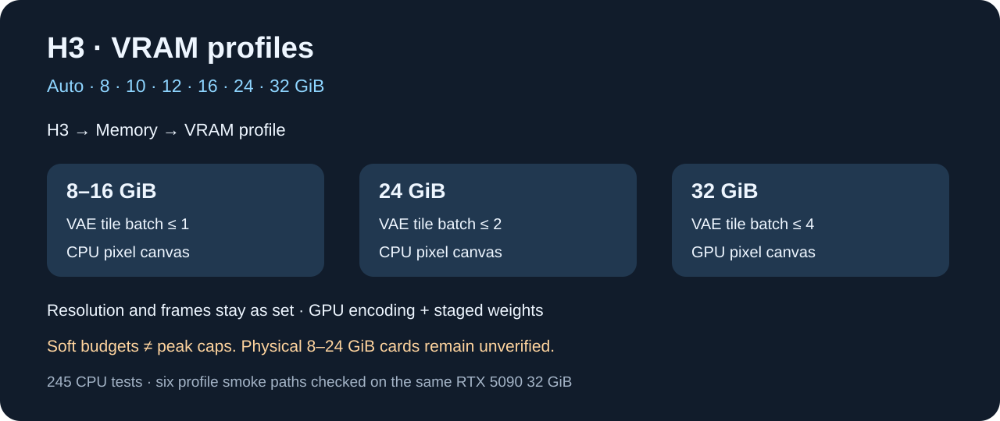

# Integration validation

CPU validation of the unified extension: 138 main tests and 107 imported native-backend tests pass, 245 total. Tests cover the single H3 preset, Output precedence, legacy `H3 Video` API normalization, synthetic and physical checkpoint routing, GGUF still routing, native-script argument compatibility, sampler/scheduler choices, dimensions, step/CFG limits, batch controls, seed/prompt lists, LoRA parameters, memory modes, cancellation, frame grids, audio shift, FL2VA/Ref2VA references, compatibility gates and route isolation. Imported flow tests execute toy-size real tensor operations; they are not full-model GPU benchmarks.

A separate Boogu regression suite passed 75 tests after its installed refresh-snapshot fix. It is reported separately because Boogu is not an H3 feature.

## Current native evidence

Forge Neo 2.29.2 on RTX 5090 with 96 GB RAM used the physical FL2VA int8 ConvRot checkpoint and the approved Qwen3-VL-32B INT4 ConvRot encoder. These backend checks preceded the single-preset UI update. All three requests used seed 62026 at 384 × 256:

| Request | Result | Settings | Wall time |
| --- | --- | --- | --- |
| Native Still image | HTTP 200, one image | 2 steps, 5-frame native request | 34.74 s |
| Video with audio | HTTP 200, MP4 written | 4 steps, 22 frames, audio enabled | 21.49 s |
| Silent video | HTTP 200, MP4 written | 4 steps, 22 frames, audio disabled | 15.02 s |

The recorded generation metadata names `Qwen3-VL-32B-TextEncoder-minimax-h3-int4_convrot--For-MiniMax-H3.safetensors`, so these runs are valid INT4 encoder evidence. The approved file is Merserk/MiniMax-H3-INT4-ConvRot revision `3c167bc916cab6cf3b85b9e3769952757ebb2e5d`, size 14,952,506,624 bytes, SHA256 `4389571ab5db4180bcae33d13d07855319530f60a85ab0f1061379401a8ef66c`.

These small requests prove functional routing, generation and export. They do not establish production quality or representative speed.

## Unified live evidence

The live UI contract reported exactly one `H3` preset and both `Still image` and `Video` choices for txt2img and img2img. The unified API used `forge_preset="H3"` with `pi_h3_output="Video"` and the same INT4 encoder:

| Request | Result | Wall time |
| --- | --- | --- |
| Video with audio | HTTP 200, 22 frames, audio enabled | 46.17 s |
| Silent video | HTTP 200, 22 frames, audio disabled | 16.38 s |
| First-frame conditioning | HTTP 200, first-frame metadata present | 31.53 s |
| Last-frame conditioning | HTTP 200, last-frame metadata present | 22.97 s |
| First + last frames | HTTP 200, both metadata flags present | 22.89 s |

The dedicated still worker also passed all 20 tested combinations of ER SDE, Euler, Heun, DPM++ 2M and Res Multistep with Simple, Normal, Beta and Karras schedules. The first cold ER SDE / Simple request took 60.2 seconds; warm tiny-setting requests took 2.08–3.88 seconds. These timings are functional evidence only.

## Still editing evidence

Unified Still image editing returned HTTP 200 with one 512 × 768 image in 66.34 seconds using ER SDE / Simple, 12 steps, seed 62026 and one reference. The prompt requested the same adult woman with a blue-sea background and natural skin texture. Visual inspection found visible pores and the requested sea background. This is one visual check, not a general identity or fidelity guarantee.

## Stop and recovery evidence

The prior `NoneType` Stop error was fixed with an H3-only cancellation guard. Final live results recorded:

| Request | Result | Wall time |
| --- | --- | --- |
| Early Stop | HTTP 200, zero images | 11.36 s |
| Recovery after early Stop | HTTP 200, one image | 20.82 s |
| Stop during sampling | HTTP 200, zero images | 8.99 s |
| Recovery after sampling Stop | HTTP 200, one image | 12.91 s |

The saved `H3 Video` setting also migrated to the single `H3` preset, and an API Video request sent before normal UI interaction returned HTTP 200 with one image in 40.89 seconds. An earlier worker-start interruption was not reproduced after restart; its exact cause remains unknown.

Fixed during integration: stale conditioning after component changes; incorrect sampler metadata after fallback; worker script relative import; nonfinite denoise; fractional batch truncation; invalid reference objects; nonfinite/out-of-range LoRA controls; native frame/audio/mode validation; redundant component-header scans; and AutoLink’s stale component list after automatic renaming. Text encoder and VAE weights now offload before still sampling while preserving DiT residency and conditioning cache.

Full-model Ref2VA, GGUF, W4A8 and FastH3 runs require their matching checkpoint files and remain unverified locally. CPU coverage and upstream reports do not substitute for those runs. No universal quantization, hardware, image fidelity or speed claim is made.

## Prior validation

# Validation — September 28, 2026

Tested on Forge Neo 2.29.1, RTX 5090 (32 GB), 96 GB RAM, using the
existing FL2VA int8_convrot model, Qwen3-VL-32B NVFP4 AWQ encoder and
H3 video VAE FP16. A separate Forge test instance preserved normal settings.

## Passed

- 55 automated tests passed, plus Python compilation. (Follow-up fixes
  September 28, 2026 raised the suite to 58 tests, all passing.)

- Native API and UI portrait generation: 1536 × 2048, ER SDE/Simple,
  CFG 1, 50 steps, no LoRA. API baseline: 86.42 seconds; UI natural portrait:
  approximately 88 seconds. Visible pores and fine lines; no obvious waxy
  smoothing in the inspected samples. This is visual judgment, not a general
  quality guarantee.
- Portrait editing: 768 × 1024, 30 steps, 82.14 seconds. White shirt changed
  to green; face, hair and composition stayed visually consistent.
- Same prompt and seed with different references reproduced the supplied
  portrait and teapot, confirming actual reference influence.
- Real LoRA off/on/off: adapter changed pixels; removal restored the exact
  original pixels (maximum difference 0).
- Two-image batch returned seeds 34567 and 34568.
- Browser refresh during generation preserved H3 and returned both images.
  Fixed the temporary checkpoint-list conflict with Ideogram.
- Native Stop during reference encoding returned no image and released GPU
  memory to 553 MiB total device use. Stop during sampling returned no image,
  wrote no output and exited the worker.
- Generation recovered after Stop. Keep-loaded mode retained the worker;
  switching to a non-H3 checkpoint exited it successfully.

## Follow-up fixes (September 28, 2026, live session)

- Unsupported sampler/scheduler left by another model's config preset now
  fall back to ER SDE / Simple with a console note instead of raising
  ValueError mid-run (regression observed live after switching presets).
- Malformed LoRA strength tags (e.g. `<lora:x:1.2.3>`) now produce a styled,
  specific error instead of an unhandled ValueError.
- Safetensors header validation now whitelists known dtypes; files carrying
  unknown dtype strings are rejected before reaching the backend.
- Forge-side models are unloaded before every H3 request (previously only on
  worker spawn), and the worker clears the CUDA cache after each request,
  eliminating co-residency VRAM overflow when switching models.
- Worker transport closes stdin before terminate so queued writes flush.
- Failed Forge/preset integration in scripts/engine.py now re-raises after
  logging instead of silently leaving a broken UI.

## Limits

A later cold 3.15 MP UI run took 294 seconds to reach step 34/50 before
manual Stop. A 12 GB reserve experiment did not reach its first step within
the test window and was stopped; it is not enabled. The earlier 86-second
result is not a guaranteed speed. Investigate load/first-step latency on an
idle GPU before claiming consistent high speed. Separate GPU contexts were
present during the later tests, but their effect was not established.

At the time of this older validation, real integer INT4 H3 inference and the
new native GGUF route had not yet been established. See the current sections
above and `QUANTIZATION.md` for the updated evidence and route boundaries.

FL2VA reference editing is experimental; Ref2VA is the trained reference model.
The 3.15 MP reference edit was stopped after 393 seconds of conditioning;
use smaller editing tests first. Nine-reference fidelity, other GPUs, AMD,
CPU-only performance and low-VRAM configurations are not validated.
No skin filter or Forge core patch was added. The pre-existing core change
in modules/launch_utils.py was preserved.

Detailed logs and generated samples are in the sibling development workspace
`project-invisible-ideogram-4/work/h3-research`.

## Final UI and startup regressions

The primary Output control stays visible in Video mode, remains open while switching, and saves the selected mode before component callbacks run. H3 repairs incompatible automatic video component sets while preserving explicit requests for validation. Concurrent checkpoint refreshes are serialized while H3 is selected; the LLaDA, SenseNova and Boogu registry readers received small snapshot fixes locally. Their portable patches are included under startup-fixes. Final UI captures use a CPU-only isolated Forge instance; earlier generation evidence used the RTX 5090.

## Video quality correction

The reported poor clips used **384 × 256, 4 steps and 22 frames**; one also used the incompatible NVFP4 native encoder. Those files are functional smoke tests, not quality examples. Native video rejects that encoder; use INT4 ConvRot, compatible INT8, or BF16.

Video now starts at **1152 × 768**, matching upstream's recommended 768-pixel short side, with 20 steps, 124 frames, CFG 1, video Shift 12 and audio Shift 3. Higher resolution needs more processing time. An empty component override now correctly chooses the automatic H3 components.

A new RTX 5090 run at these settings, seed 62026, completed in **335.82 seconds including loading**. Four sampled frames showed consistent facial features, visible freckles and finer detail than the tiny smoke clips. This is one inspected result, not a universal quality guarantee.

[Watch the generated 5.17-second H3 sample](docs/assets/video-quality-768p.mp4). This example was generated with H3; no upscaling or sharpening was applied.

### Adapter performance

Native Forge can parse H3-compatible LoRA, LoHA, LoKr and DoRA weights when
their tensor keys match the model. Only plain 2D LoRA uses H3's optimized
quantized low-rank path. LoHA, LoKr, DoRA, LoCon/mid-weight, offset and
transformed patches use Forge's compatibility path, which may dequantize
weights each forward and require more time and VRAM. Full H3 GPU generation
with LoHA, LoKr and DoRA files remains unverified; CPU fallback tests do not
establish their full-model performance.

### Measured video memory and time

The 1152 x 768, 124-frame, 20-step RTX 5090 quality run took 335.82 seconds
including loading. A single total-GPU-memory observation was 26,784 MiB
(26.16 GiB); this was not peak telemetry or an isolated allocation measure.
It used the INT8 ConvRot DiT and INT4 ConvRot encoder with Forge offloading.
Speed and memory vary with dimensions, frames, components and adapters.
The still worker's Memory mode and Keep model controls do not govern native
video or GGUF; those routes use Forge memory management.

## VRAM profiles: 8 / 10 / 12 / 16 / 24 / 32 GiB

Open **H3 > Memory > VRAM profile**. **Auto** is the default; choose a smaller
profile to favor offloading. Both the native route and the dedicated still
worker understand these profiles. They are **soft weight-residency budgets,
not hard GPU peak limits**. Resolution, frames, steps and model precision
remain exactly as requested. Very large requests can still run out of memory.

| Profile | Native VAE tile batch cap | Memory behavior |
| --- | --- | --- |
| 8 / 10 / 12 / 16 | 1 | Partial GPU weights; CPU pixel canvas |
| 24 | 2 | Partial GPU weights; CPU pixel canvas |
| 32 | 4 | GPU pixel canvas; larger weight residency |
| Auto | Follows detected capacity | Detects GPU memory; worker also checks free memory |

The profiles leave approximately 2 GiB of inference/OS headroom and respect
larger existing Forge reservations. Native H3 restores Forge's prior memory
settings after each request. Completed conditioning weights are offloaded
before sampling; video VAE loading now accounts for decoding activations.
The overlap size, blending order and sampling math are preserved. Auto keeps
GPU text encoding available: forcing low/no-VRAM mode sent the entire large
encoder to CPU and was much slower. Explicit Still worker lowvram remains
available. Detection failures use conservative offloading rather than forcing
full residency. No Generate-time model download is added.

### Validation limits

All six profiles completed identical 384 x 256, 22-frame, 2-step native
functional requests on the **same physical RTX 5090 32 GiB card**. These are
neither quality examples nor physical 8–24 GiB compatibility tests. The first
8 GiB cold request observed **15,027 MiB total GPU usage**, demonstrating why
a soft profile is not an 8 GiB hard cap. Subsequent requests reused conditioning
and kernels; their timings cannot be compared as independent cold benchmarks.
The exact hardware/quantization combination must still be tested on smaller
cards. Large system RAM and a fast local drive remain necessary for offloading.

CPU validation: **138 main + 107 native = 245 tests**. Tests include all six
profile choices, free-memory pressure, invalid/detection-failure handling,
restoration after exceptions, unchanged dimensions and exact tile/canvas
values on deterministic tensor fixtures. They do not prove every GPU kernel,
quantization, LoKr/LoHA/DoRA adapter, or maximum workload fits a smaller card.

### Full quality regression with the 32 GiB profile

The 1152 x 768, 124-frame, 20-step request also passed (HTTP 200). Warm elapsed
time was **239.30 seconds**. One-second sampling observed a maximum **28,267 MiB
total GPU use (27.60 GiB)**, including the host; this is not exact allocator peak
telemetry. Earlier 335.82-second evidence was a cold run, so these timings do
not establish a speedup. Video and audio decoded without errors.

[View the new full-quality sample](docs/assets/video-memory-profile32.mp4).

### Dedicated still-worker regression

The 8 GiB soft profile completed a 384 x 256, 2-step functional image request
in **56.07 seconds**, using the local INT8 ConvRot DiT, NVFP4-AWQ encoder and
FP16 VAE on the same physical 32 GiB GPU. This is not physical 8 GiB testing.
The test exposed a quantized Parameter version-counter error during offload;
the worker now uses no-grad inference, retaining tensor version counters
without storing autograd activations. The real request passed after the fix.
